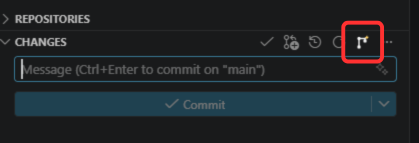
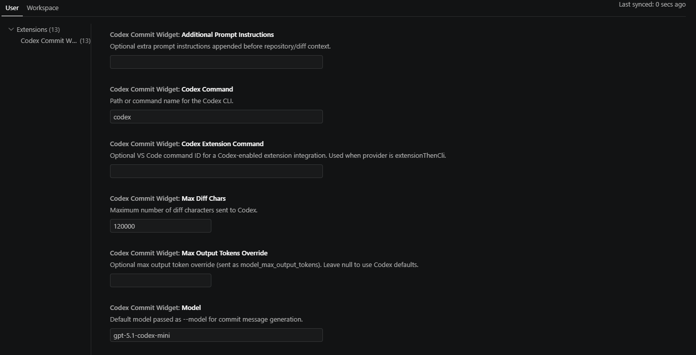
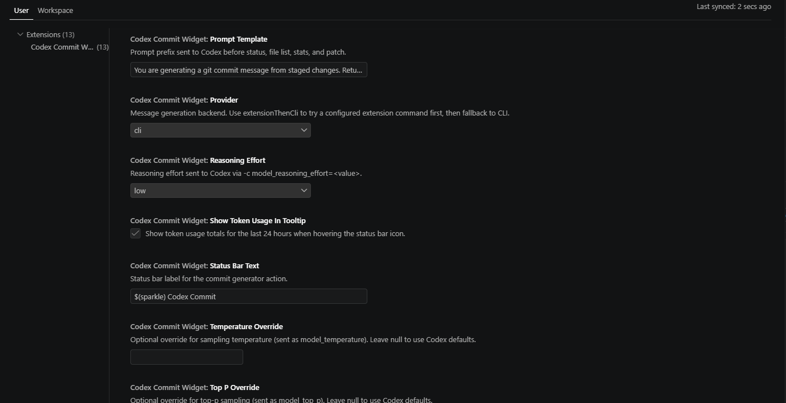

# Configuration Guide

This document shows practical `settings.json` examples for Codex Commit Widget.

Applies to extension release: `v1.7.0`.

## Visual Preview

Commit action in Source Control:



Settings examples:




## Baseline

```json
{
  "codexCommitWidget.provider": "cli",
  "codexCommitWidget.codexCommand": "codex",
  "codexCommitWidget.model": "gpt-5.1-codex-mini",
  "codexCommitWidget.reasoningEffort": "low",
  "codexCommitWidget.enableSidebarAction": true
}
```

## CLI Setup

If Codex CLI is installed globally (recommended: `npm install -g @openai/codex@latest`) but not detected in VS Code:

1. Run `Codex: Setup Codex CLI` from the Command Palette.
2. Or use the sidebar action `Setup Codex CLI` in the Codex Commit view.

## Prompt Customization

```json
{
  "codexCommitWidget.promptTemplate": "You are generating a git commit message from staged changes. Return only the commit message. Use conventional commits and include a short risk audit.",
  "codexCommitWidget.additionalPromptInstructions": "Prefer imperative verbs in subject lines. Mention migrations explicitly if present. Keep sections concise."
}
```

## Sampling Overrides

Use these only when you want explicit control over style variability and response size.

```json
{
  "codexCommitWidget.temperatureOverride": 0.2,
  "codexCommitWidget.topPOverride": 0.95,
  "codexCommitWidget.maxOutputTokensOverride": 500
}
```

Set each value to `null` to let Codex defaults apply.

## Token Usage Analytics

```json
{
  "codexCommitWidget.trackTokenUsageAnalytics": true,
  "codexCommitWidget.analyticsRetentionDays": 7
}
```

The extension auto-populates these settings from tracked runs:

- `codexCommitWidget.analyticsSummary`
- `codexCommitWidget.analyticsTotalTokens`
- `codexCommitWidget.analyticsInputTokens`
- `codexCommitWidget.analyticsOutputTokens`
- `codexCommitWidget.analyticsGenerations`
- `codexCommitWidget.analyticsEstimatedRuns`
- `codexCommitWidget.analyticsLastUpdated`

Entries older than `analyticsRetentionDays` are automatically cleared.

## UI Customization

```json
{
  "codexCommitWidget.statusBarText": "$(sparkle) Smart Commit"
}
```

Toggle the sidebar action:

```json
{
  "codexCommitWidget.enableSidebarAction": true
}
```

## Auth Requirement

If generation fails due to authentication, run:

```bash
codex login
```

Then run commit generation again.

## Codex CLI Version

This extension is tuned for Codex CLI `0.120.0` and newer.

Check your installed version:

```bash
codex --version
```

Upgrade to latest:

```bash
npm install -g @openai/codex@latest
```
