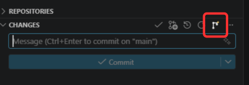
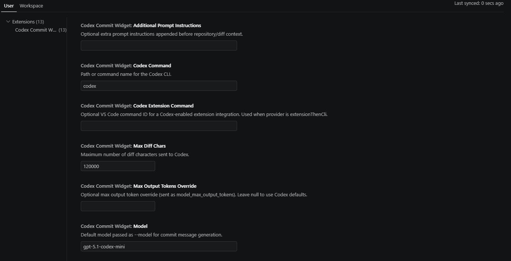
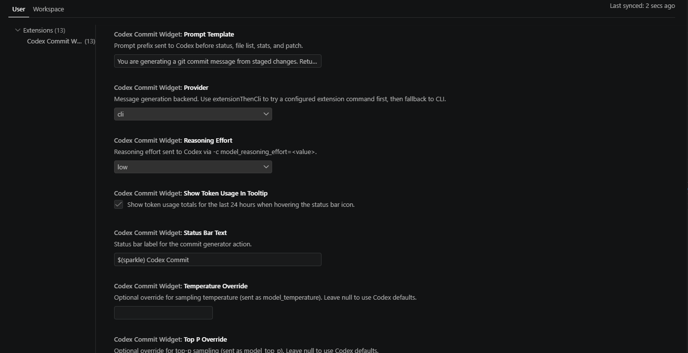

# Configuration Guide

This document shows practical `settings.json` examples for **AI Commit & Prompt Helper**.

Applies to extension release: `v2.0.6`.

## Visual Preview

Commit action in Source Control:



Settings examples:




## Baseline

Select the **AI Helper** Activity Bar icon to open the settings panel. On first use it
opens as a setup wizard; after setup is saved, the same icon opens normal settings. Use
**Run Setup Wizard** in the panel to repeat provider setup later.

The panel writes non-secret settings shown below, while hiding controls that are not used
by the selected provider. API keys entered in the panel are stored in VS Code
SecretStorage. Existing key values in `settings.json` still work as migration fallbacks.

```json
{
  "codexCommitWidget.provider": "codexCli",
  "codexCommitWidget.codexCommand": "codex",
  "codexCommitWidget.model": "",
  "codexCommitWidget.reasoningEffort": "low"
}
```

Leave `model` empty to use the built-in default for the selected provider. For non-custom
HTTP providers, the settings panel only saves models from that provider's bundled or
refreshed model list. Arbitrary custom model IDs are reserved for Codex CLI and custom
OpenAI-compatible endpoints.

## Provider Examples

OpenAI:

```json
{
  "codexCommitWidget.provider": "openai",
  "codexCommitWidget.model": "gpt-5.5",
  "codexCommitWidget.openAiApiKey": ""
}
```

DeepSeek:

```json
{
  "codexCommitWidget.provider": "deepseek",
  "codexCommitWidget.model": "deepseek-v4-flash",
  "codexCommitWidget.deepSeekApiKey": ""
}
```

Anthropic Claude:

```json
{
  "codexCommitWidget.provider": "anthropic",
  "codexCommitWidget.model": "claude-opus-4-1-20250805",
  "codexCommitWidget.anthropicApiKey": ""
}
```

Google Gemini:

```json
{
  "codexCommitWidget.provider": "gemini",
  "codexCommitWidget.model": "gemini-3.5-flash",
  "codexCommitWidget.geminiApiKey": ""
}
```

Mistral, Cohere, OpenRouter, Hugging Face, and custom OpenAI-compatible endpoints:

```json
{
  "codexCommitWidget.provider": "mistral",
  "codexCommitWidget.model": "mistral-medium-latest",
  "codexCommitWidget.mistralApiKey": ""
}
```

```json
{
  "codexCommitWidget.provider": "cohere",
  "codexCommitWidget.model": "command-a-plus-05-2026",
  "codexCommitWidget.cohereApiKey": ""
}
```

```json
{
  "codexCommitWidget.provider": "openrouter",
  "codexCommitWidget.model": "openai/gpt-5.5",
  "codexCommitWidget.openRouterApiKey": ""
}
```

```json
{
  "codexCommitWidget.provider": "huggingface",
  "codexCommitWidget.model": "openai/gpt-oss-120b",
  "codexCommitWidget.huggingFaceApiKey": ""
}
```

```json
{
  "codexCommitWidget.provider": "customOpenAiCompatible",
  "codexCommitWidget.customOpenAiCompatibleBaseUrl": "https://api.example.com/v1",
  "codexCommitWidget.model": "provider-model-id",
  "codexCommitWidget.customOpenAiCompatibleApiKey": ""
}
```

Prefer the setup panel or environment variables for API keys. Environment fallbacks:

- `OPENAI_API_KEY`
- `DEEPSEEK_API_KEY`
- `ANTHROPIC_API_KEY`
- `COHERE_API_KEY`
- `GEMINI_API_KEY` or `GOOGLE_API_KEY`
- `MISTRAL_API_KEY`
- `OPENROUTER_API_KEY`
- `HF_TOKEN` or `HUGGINGFACE_API_KEY`
- `OPENAI_COMPATIBLE_API_KEY`

Model refresh and pricing:

- OpenAI-compatible providers use their `/models` endpoint when available.
- Anthropic, Cohere, Gemini, Mistral, OpenRouter, Hugging Face, and custom compatible providers are queried through their provider-specific model APIs.
- Pricing appears only when a provider returns token billing metadata. If pricing is not present, the model still appears without cost text.
- DeepSeek is restricted to the supported API model names `deepseek-v4-flash` and `deepseek-v4-pro`.

Current provider presets:

- OpenAI: `gpt-5.5`, `gpt-5.4`, `gpt-5.4-mini`, `gpt-5.4-nano`
- DeepSeek: `deepseek-v4-flash`, `deepseek-v4-pro`
- Anthropic: `claude-opus-4-1-20250805`, `claude-sonnet-4-20250514`
- Cohere: `command-a-plus-05-2026`, `command-a-03-2025`, `command-a-reasoning-08-2025`
- Gemini: `gemini-3.5-flash`, `gemini-3.1-pro-preview`, `gemini-3.1-flash-lite`
- Mistral: `mistral-medium-latest`, `mistral-large-latest`, `mistral-small-latest`, `ministral-14b-latest`
- OpenRouter: `openai/gpt-5.5`, `google/gemini-3.5-flash`, `deepseek/deepseek-v4-flash`, `qwen/qwen3.7-max`
- Hugging Face: `openai/gpt-oss-120b`, `Qwen/Qwen3-Coder-480B-A35B-Instruct`, `deepseek-ai/DeepSeek-R1`

## CLI Setup

If Codex CLI is installed globally but not detected in VS Code:

1. Select the **AI Helper** Activity Bar icon.
2. Use **Run Setup Wizard**.
3. Save the detected or manually entered `codexCommitWidget.codexCommand`.

## Prompt Customization

```json
{
  "codexCommitWidget.promptTemplate": "You are generating a git commit message from staged changes. Return only the commit message. Use conventional commits and include a short risk audit.",
  "codexCommitWidget.additionalPromptInstructions": "Prefer imperative verbs in subject lines. Mention migrations explicitly if present. Keep sections concise."
}
```

## Improve Prompt

Run `AI Helper: Improve Prompt` from the Command Palette to rewrite selected editor text
into a clearer coding-agent prompt. If no text is selected, the extension asks for prompt
text first. It uses the same configured provider, model, API key, reasoning effort, and
sampling overrides, then opens a review document before you copy, open, or replace the
result.

## Sampling Overrides

Use these only when you want explicit control over style variability and response size.

```json
{
  "codexCommitWidget.temperatureOverride": 0.2,
  "codexCommitWidget.topPOverride": 0.95,
  "codexCommitWidget.maxOutputTokensOverride": 500
}
```

Set each value to `null` to let provider defaults apply.

## Token Usage Analytics

```json
{
  "codexCommitWidget.trackTokenUsageAnalytics": true,
  "codexCommitWidget.analyticsRetentionDays": 7
}
```

The extension auto-populates these settings from tracked runs:

- `codexCommitWidget.analyticsSummary`
- `codexCommitWidget.analyticsTotalTokens`
- `codexCommitWidget.analyticsInputTokens`
- `codexCommitWidget.analyticsOutputTokens`
- `codexCommitWidget.analyticsGenerations`
- `codexCommitWidget.analyticsEstimatedRuns`
- `codexCommitWidget.analyticsLastUpdated`

## Migration From v1

New settings use `codexCommitWidget.*`. Existing `aiCommitPromptHelper.*` values are read
as fallbacks, but update your settings to the public extension namespace when practical.
